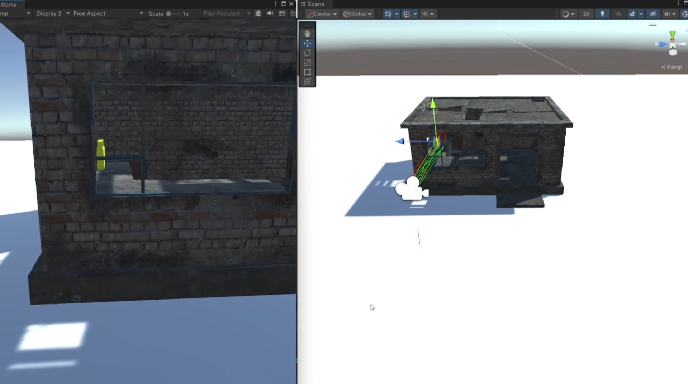
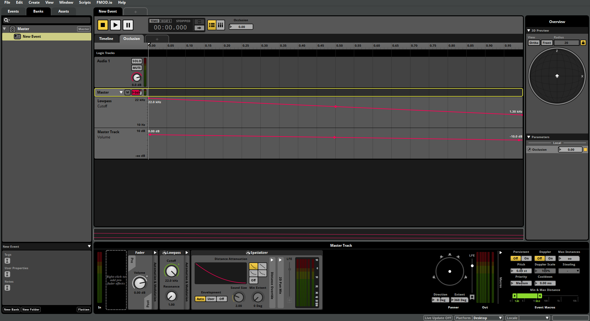

# Unity Project with FMOD and Occlusion Handling

## Overview

This Unity project demonstrates the integration of the FMOD audio engine into Unity, with an emphasis on implementing occlusion handling. Occlusion in audio refers to the simulation of sound being blocked or partially blocked by obstacles, creating a more realistic sound experience in games. This project includes a script that handles occlusion based on the position of the player and obstacles in the environment.

## Project Structure

### 1. **FMOD Integration**
   - The project uses FMOD, a powerful audio tool that allows for complex sound designs and real-time audio manipulation.
   - The `FMODUnity` and `FMOD.Studio` namespaces are used to interact with FMOD events within Unity.

### 2. **Occlusion Handling**
   - The core functionality is handled by the `FirstPersonOcclusion.cs` script.
   - This script uses raycasting to detect obstacles between the sound source and the listener (usually the player).
   - The script adjusts the audio parameters in FMOD to simulate occlusion based on the detected obstacles.

## Setup Instructions

### Prerequisites
- **Unity**: Ensure that Unity is installed (version 2021.1 or later is recommended).
- **FMOD Studio**: Download and install FMOD Studio. Also, ensure that the FMOD Unity integration package is imported into the Unity project.

### Installation

1. **Clone or Download the Project**: 
   - Clone this repository or download the ZIP file and extract it.

2. **Import FMOD Package**:
   - If not already imported, download the FMOD Unity Integration package from [FMOD's official website](https://fmod.com/).
   - Import the FMOD Unity package into your Unity project.

3. **Link FMOD to Unity**:
   - Open the FMOD settings in Unity (`FMOD > Edit Settings`) and link your FMOD Studio project by specifying the path to your `.fspro` file.
   - Ensure that the necessary FMOD banks are built and available in Unity.

4. **Set Up Occlusion Parameters**:
   - Ensure that your FMOD events have a parameter named `Occlusion`, which will be controlled by the `FirstPersonOcclusion.cs` script.

5. **Configure Layers**:
   - The `OcclusionLayer` in the `FirstPersonOcclusion.cs` script determines which layers are considered for occlusion checks. Make sure the relevant obstacles are assigned to these layers.

6. **Attach the Script**:
   - Attach the `FirstPersonOcclusion.cs` script to the GameObject that represents the sound source in your Unity scene.
   - Assign the appropriate FMOD event to the `SelectAudio` field in the script.

### Running the Project

- Press `Play` in Unity to run the project. As you move the listener (typically the player) around the scene, the script will automatically handle the occlusion by adjusting the FMOD event's `Occlusion` parameter based on the obstacles detected between the sound source and the listener.

### Customization

- **SoundOcclusionWidening** and **PlayerOcclusionWidening**: These parameters in the `FirstPersonOcclusion.cs` script control the width of the area checked for occlusion. Adjust these to fine-tune how occlusion is calculated in your scene.
  
- **OcclusionLayer**: This determines which objects in the scene can block sound. Modify this to include or exclude certain layers from the occlusion calculations.

## Troubleshooting

- **No Sound or Incorrect Occlusion**: Ensure that the FMOD event is correctly assigned in the Unity Inspector and that the `Occlusion` parameter exists in the FMOD event.
- **Raycast Issues**: Check that the objects you expect to cause occlusion are on the correct layers as defined by `OcclusionLayer`.

## Acknowledgements

A special thanks to the [Scott Game Sounds YouTube channel](https://www.youtube.com/watch?v=wTOHc803_ys&t=3641s) for their invaluable tutorials and guidance. Their content played a significant role in helping to create and refine this project.

## Pictures

## Youtube

[Watch this demo video](https://youtu.be/3ppX4MGABNY)

